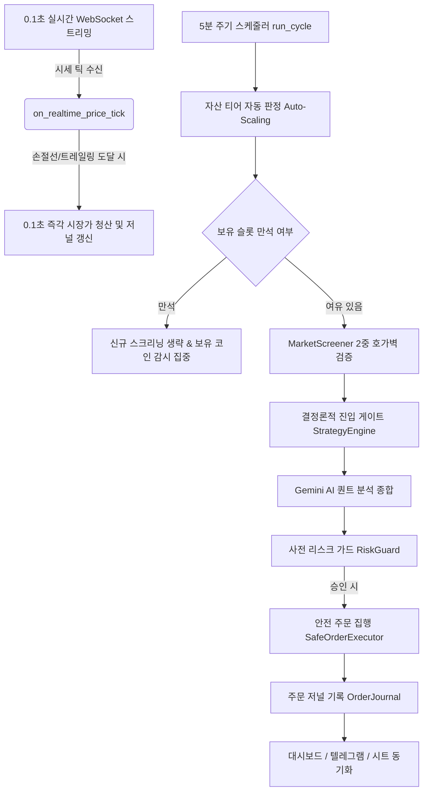

# Bithumb AI Pro Quant Trading Bot (v4.5)

본 문서는 `c:\AI\bithumb` 디렉토리에 위치한 Bithumb 기반 AI 퀀트 트레이딩 봇의 프로젝트 설명 및 아키텍처 설계서입니다. 이 문서는 다른 AI 에이전트 또는 개발자가 프로젝트의 전반적인 구조와 핵심 로직을 빠르고 명확하게 파악할 수 있도록 작성되었습니다.

> [!IMPORTANT]
> **개발 가이드라인**: 코드가 수정되거나 새로운 기능/모듈이 추가될 때마다 본 `PROJECT_DESIGN.md` 문서를 **반드시 함께 최신 상태로 갱신**해야 합니다.

---

## 1. 프로젝트 개요

이 프로젝트는 빗썸(Bithumb) 거래소의 실시간 데이터와 Google Gemini AI를 결합하여, 유망한 단타/스윙 종목을 자동으로 탐색하고 매매를 수행하는 **AI 기반 퀀트 트레이딩 시스템**입니다. 

- **언어 및 환경**: Python 3, Windows 환경 (`.bat` 및 `.ps1` 스크립트 기반 구동)
- **핵심 기술**: Bithumb REST API & WebSocket (v1/v2), Google Gemini API (Flash 모델군), Telegram API, Google Sheets API
- **주요 전략 및 아키텍처**: 
  - **다중 시간대(MTF) 분석**: 1시간봉 대세 추세 + 5분봉 정밀 타점 정렬
  - **거래대금 및 모멘텀 기반 동적 시장 스크리닝**: 24시간 거래대금 $\ge 10$억 원, 당일 상승률 +1.0%~+25.0%
  - **2중 호가 안전망 (Fail-Closed)**: 매수/매도 스프레드 $\le 0.35\%$, 상위 5호가 누적 매수 잔량 $\ge 2,000$만 원 검증
  - **결정론적 기술지표 엔진**: 볼린저 밴드(%B), RSI, ATR, MACD, EMA 기반 진입 게이트 (LLM 환각 차단)
  - **0.1초 초저지연 실시간 리스크 엔진**: WebSocket 틱 기반 0.1초 즉각 손절, 1차 50% 분할익절, 무한 트레일링 스탑
  - **자산 연동형 3단계 스마트 Auto-Scaling**: 계좌 총 자산 규모에 따른 보유 슬롯(2~4개) 및 비중(25~50%) 자동 전환
  - **장중 자금 입출금 자동 보정 (Cashflow Adjustment)**: 입출금 시 시작 기준자산을 자동 보정하여 순수 매매 수익률 보존
  - **통신 및 리소스 최적화**: HTTP Keep-Alive 커넥션 풀링(RTT 30% 단축), 슬롯 만석 시 AI 호출 생략(사이클 1초대), 텔레그램 알림 디바운싱
  - **주문 무결성 및 소유권 보호**: 멱등성 저널(`OrderJournal`), 봇 주문 식별(`is_managed_order`), 일원화 취소(`cancel_bot_open_orders`)

---

## 2. 디렉토리 구조 및 주요 파일

```text
c:\AI\bithumb\
├── .env                  # 환경변수 파일 (API 키, 텔레그램 토큰, 설정값 등)
├── requirements.txt      # Python 의존성 패키지 목록
├── PROJECT_DESIGN.md     # 프로젝트 아키텍처 및 시스템 설계서 (상시 최신 동기화)
├── logs/                 # 일자별 트레이딩 및 시스템 로그 보관 (30일 보존)
├── data/                 # 로컬 영구/상태 데이터 저장 폴더
│   ├── daily_stats.json       # 일일 손익 통계, 시작 기준자산 및 킬스위치 상태 (00:00 KST 자정 리셋)
│   ├── position_state.json    # 포지션별 최고가, 진입 시간 및 1차 익절 상태
│   ├── trade_memory.json      # 완료된 거래 내역 및 자가학습 피드백 메모리
│   ├── order_journal.json     # 멱등성 보장 주문 상태 추적 저널 (원자적 저장)
│   ├── cooldown_state.json    # 재진입 쿨다운 상태 영속화 (손절 45분, 익절 15분)
│   └── paper_account.json     # 모의투자(Paper Trading) 가상 원장 잔고
├── config/               # 설정 파일 폴더
│   └── service_account.json   # Google Sheets 연동을 위한 GCP 서비스 계정 키
├── src/                  # 핵심 소스코드 디렉토리
│   ├── main.py                     # 봇의 진입점(Entry Point), 스케줄러, 실시간 웹소켓 콜백, 자금 관리 오케스트레이션
│   ├── bithumb_api.py              # 빗썸 REST API 클라이언트 (Keep-Alive 세션 풀, v1/v2 호환, JWT 인증, 자동 재시도)
│   ├── websocket_manager.py        # 빗썸 Public WebSocket 클라이언트 (0.1초 실시간 틱/호가/고래 체결 스트리밍, Heartbeat 안정화)
│   ├── private_websocket_manager.py# 빗썸 Private WebSocket 클라이언트 (MyOrder, MyAsset 체결 스트리밍)
│   ├── order_safety.py             # 주문 저널(`OrderJournal`), 멱등성 집행(`SafeOrderExecutor`), 리스크 검증(`RiskGuard`), 동적 티어
│   ├── strategy_engine.py          # 표준 기술지표(RSI, BB, ATR, MACD, EMA) 계산, 샹들리에 스탑, 결정론적 진입 게이트
│   ├── gemini_analyzer.py          # Gemini AI 퀀트 분석 및 시그널 생성 엔진 (안정형 모델 라우팅)
│   ├── market_screener.py          # 조건(거래대금, 상승률, 스프레드, 호가깊이) 시장 동적 탐색 (Fail-Closed)
│   ├── paper_broker.py             # 모의투자 어댑터 (공용 시세 기반 가상 체결 및 원장 관리)
│   ├── trade_memory.py             # 트레이딩 기록, 통계 및 AI 자가학습 메모리 관리
│   ├── telegram_alert.py           # 텔레그램 양방향 원격 제어(/status, /panic 등), 디바운싱 알림, 차트 전송
│   ├── sheets_manager.py           # Google Sheets 기반 매매 일지 및 대시보드 자동 기록
│   ├── chart_renderer.py           # matplotlib 기반 매매 시점 캔들 차트 이미지 렌더링 (다크 테마)
│   ├── web_server.py               # 로컬 실시간 웹 대시보드 서버 (포트 7979, 주문저널/거래이력 실시간 서빙)
│   └── backtest.py                 # 과거 데이터 기반 퀀트 전략 백테스터 (Next-Bar Open, 인트라바 편향 제거, 페이징)
├── tests/                # 단위 테스트 디렉토리 (총 23개 테스트 스위트)
│   ├── test_market_screener.py
│   ├── test_order_safety.py
│   ├── test_paper_broker.py
│   ├── test_strategy_engine.py
│   └── test_realtime_risk.py
└── *.bat, *.ps1          # 봇 실행, 중지, 상태 확인, 로그 조회를 위한 스크립트
```

---

## 3. 핵심 모듈 설계 및 상세 동작 원리

### 3.1. `main.py` (시스템 오케스트레이션 & 자금 관리)
- **주기적 실행 (`run_cycle`)**: 5분마다 실행되며, 자산 티어 판정 $\rightarrow$ 스크리닝 $\rightarrow$ 정량 지표 및 AI 분석 $\rightarrow$ 리스크 가드 검증 $\rightarrow$ 안전 주문 집행을 수행합니다.
- **초저지연 리스크 감시**: `ws_client`의 `on_realtime_price_tick` 콜백을 통해 0.1초 실시간 체결가를 감시하여, 손절가 또는 트레일링 익절가 도달 시 **0.1초 만에 즉시 청산**합니다.
- **스마트 자산 티어링 (Auto-Scaling)**: `get_dynamic_portfolio_tiers()`를 통해 총 자산에 맞춰 동적으로 슬롯 및 비중을 조절합니다:
  - `< 30만 원`: 최대 2종목 (종목당 50% 집중)
  - `30만 ~ 100만 원`: 최대 3종목 (종목당 35% 분산)
  - `≥ 100만 원`: 최대 4종목 (종목당 25% 고도 분산)
- **장중 자금 입출금 자동 보정 (Cashflow Adjustment)**: 장중 입출금 발생 시 `daily_start_equity`를 자동 보정하여 당일 평가손익률 왜곡을 원천 방지합니다.
- **포지션 만석 시 최적화**: 슬롯이 꽉 찼을 때는 신규 스크리닝 및 AI 호출을 생략하여 사이클 실행 시간을 1초 미만으로 단축하고 API 쿼터를 절약합니다.

### 3.2. `order_safety.py` (주문 안전성 & 리스크 가드)
- **`OrderJournal`**: 원자적 파일 쓰기(`write_json_atomically`)와 `threading.Lock`을 통해 크래시 복구 및 멀티스레드 안전성을 보장합니다. `is_managed_order()`를 통해 봇 주문과 사용자의 수동 주문을 완벽히 분리합니다.
- **`SafeOrderExecutor`**: 주문 전송 전 `client_order_id`를 저널에 기록하고, 네트워크 타임아웃 발생 시 상태를 `UNKNOWN`으로 보존하여 중복 주문을 차단합니다.
- **`RiskGuard`**: 1회 최대 주문액, 종목당 최대 비중, 총 투자 비중, 최대 동시 보유 포지션 수를 사전에 검증하며, `update_limits()`를 통해 동적 자산 티어와 실시간 동기화됩니다.
- **`calculate_risk_position_size`**: 1회 거래당 총 자산의 1% 고정 리스크 모델 기반 포지션 사이징을 계산합니다.

### 3.3. `strategy_engine.py` (결정론적 기술지표 엔진)
- RSI(Wilder's Smoothing), 볼린저 밴드(%B), ATR, MACD(9 EMA Signal), EMA 등 모든 기술적 지표 계산 로직을 단일화하여 제공합니다.
- **결정론적 진입 게이트 (`entry_signal`)**: MA5 > MA20, RSI 45~65, 볼린저 %B 0.35~0.75, 1시간봉 MTF 추세 일치, BTC 시장 레짐(`NORMAL / RISK_OFF / CRASH`)을 검증합니다.
- **샹들리에 스탑 (`calculate_chandelier_exit`)**: 미래 참조 편향을 제거하고 이전 확정봉 기준 고가와 ATR로 트레일링 스탑을 산출합니다.

### 3.4. `market_screener.py` (시장 동적 탐색 & 2중 호가벽)
- 빗썸 전체 KRW 마켓에서 거래대금 $\ge 10$억 원, 당일 상승률 +1.0%~+25.0% 필터를 적용합니다.
- **2중 호가 안전망 (Fail-Closed)**:
  - 매수/매도 최우선 호가 스프레드 $\le 0.35\%$ 검증
  - 상위 5호가 누적 매수 잔량 $\ge 2,000$만 원 검증
  - 호가창 조회 실패 시 보수적으로 제외(Fail-Closed)하여 슬리피지 및 잡코인 리스크 원천 차단.

### 3.5. `bithumb_api.py` & `websocket_manager.py` (거래소 통신)
- **`BithumbAPI`**: `requests.Session()` 및 `HTTPAdapter` 기반 커넥션 풀링을 적용하여 TCP/TLS 핸드셰이크를 재사용(RTT 30~50% 단축)합니다. v1/v2 주문 및 취소 자동 폴백 지원.
- **`BithumbWebSocketClient`**: `ping_interval=30`, `ping_timeout=20` 설정으로 빗썸 서버 과부하 시에도 연결을 안정적으로 유지하며 자동 재연결을 수행합니다.

### 3.6. `telegram_alert.py` & `web_server.py` (모니터링 & 제어)
- **`telegram_alert.py`**: 양방향 원격 제어(/status, /balance, /panic 등), 차트 전송 및 `send_debounced_message()`를 통한 중복 경보 방지(15분 디바운싱).
- **`web_server.py`**: 포트 7979에서 로컬 실시간 웹 대시보드를 서빙하며, 총 자산, 당일 손익, 보유 포지션, 최근 완료 거래(Trade Memory), 주문 저널(Order Journal)을 5초 주기로 동기화합니다.

---

## 4. 매매 파이프라인 (Trading Workflow)



---

## 5. 변경 이력 및 개선 히스토리 (Changelog)

| 버전 | 일자 | 주요 변경 및 최적화 내역 |
| :---: | :---: | :--- |
| **v4.5** | 2026-08-24 | • **구글 시트 Strategy 탭 실시간 동기화 및 과거 비감시 종목 자동 정리 (`prune_unmonitored_strategies`)**<br>• **장중 자금 입출금 자동 감지 & 기준자산 자동 보정** (Cashflow Adjustment 도입)<br>• **자산 연동형 3단계 스마트 Auto-Scaling** (소액 2종목 $\rightarrow$ 100만 원 이상 4종목 자동 전환)<br>• **보유 슬롯 만석 시 AI 호출 생략 및 경량화** (사이클 속도 1초 미만 단축)<br>• **HTTP Keep-Alive 커넥션 풀링 적용** (`BithumbAPI` RTT 30~50% 단축)<br>• **텔레그램 반복 경보 디바운싱** (15분 중복 알림 방지)<br>• **웹소켓 Heartbeat 튜닝** (`ping_interval=30`, `ping_timeout=20`)<br>• **최소 거래대금 완화 (`10억 원`)** 및 2중 호가벽(스프레드 0.35% + 2천만 원 잔량) 연동 |
| **v4.0** | 2026-08-24 | • **0.1초 실시간 웹소켓 즉각 손절/익절 엔진** 탑재<br>• **결정론적 정량 진입 게이트 및 MTF 1시간봉 추세 필터** 추가<br>• **주문 저널(`OrderJournal`) 멱등성 및 봇 주문 소유권 식별** 구현<br>• **백테스터 Next-Bar Open 및 인트라바 편향 제거** 완료<br>• **웹 대시보드 (Trade Memory & Order Journal 연동)** 구현 |
| **v3.0** | 이전 버전 | • Gemini AI 분석 엔진 및 텔레그램 양방향 원격 제어 기초 구축 |

---

## 6. 유지보수 및 코드 수정 원칙 (For Developers & AI Agents)

1. **설계 문서 상시 동기화**: 코드 수정 또는 기능 추가 시 반드시 본 `PROJECT_DESIGN.md` 문서를 함께 최신 상태로 갱신합니다.
2. **지표 로직 단일화**: 기술 지표 및 손익비 공식 수정 시 `strategy_engine.py`를 단일 진실 공급원(SSOT)으로 사용합니다.
3. **스레드 안전성 준수**: 주문 저널 및 공유 상태 조작 시 반드시 `threading.Lock` 및 원자적 파일 저장을 준수합니다.
4. **단위 테스트 무결성 유지**: 작업 완료 후 반드시 `python -m unittest discover tests`를 실행하여 23개 이상의 모든 단위 테스트 통과를 검증합니다.

