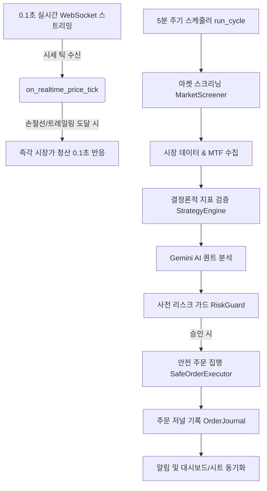

# Bithumb AI Pro Quant Trading Bot (v4.0)

본 문서는 `c:\AI\bithumb` 디렉토리에 위치한 Bithumb 기반 AI 퀀트 트레이딩 봇의 프로젝트 설명 및 아키텍처 설계서입니다. 이 문서는 다른 AI 에이전트 또는 개발자가 프로젝트의 전반적인 구조와 핵심 로직을 빠르고 명확하게 파악할 수 있도록 작성되었습니다.

> [!IMPORTANT]
> **개발 가이드라인**: 코드가 수정되거나 새로운 기능/모듈이 추가될 때마다 본 `PROJECT_DESIGN.md` 문서를 **반드시 함께 최신 상태로 갱신**해야 합니다.

---

## 1. 프로젝트 개요

이 프로젝트는 빗썸(Bithumb) 거래소의 실시간 데이터와 Google Gemini AI를 결합하여, 유망한 단타/스윙 종목을 자동으로 탐색하고 매매를 수행하는 **AI 기반 퀀트 트레이딩 시스템**입니다. 

- **언어 및 환경**: Python 3, Windows 환경 (`.bat` 및 `.ps1` 스크립트 기반 구동)
- **핵심 기술**: Bithumb REST API & WebSocket (v1/v2), Google Gemini API (Flash 모델), Telegram API, Google Sheets API
- **주요 전략**: 
  - 다중 시간대(MTF) 분석 (1시간봉 추세 + 5분봉 정밀 타점)
  - 거래대금 및 모멘텀 기반 동적 시장 스크리닝 (자동 모드 지원)
  - 호가창 및 체결강도 기반 수급 분석 + 0.1초 실시간 고래 체결 감시
  - 볼린저 밴드, RSI, ATR 기반 변동성 및 리스크 관리 (동적 익절/손절선, 50% 분할익절 & 가속 트레일링 스탑 적용)
  - **0.1초 초저지연 실시간 웹소켓 기반 즉각 손절 및 트레일링 스탑** 이벤트 드리븐 가동
  - 비트코인(BTC) 거시 환경 추적을 통한 폭락장 회피
  - 멱등성 보장 주문 저널(`OrderJournal`) 및 안전 주문 실행(`SafeOrderExecutor`)

---

## 2. 디렉토리 구조 및 주요 파일

프로젝트는 모듈화되어 있으며, 각 기능이 독립된 파일 및 디렉토리로 분리되어 있습니다.

```text
c:\AI\bithumb\
├── .env                  # 환경변수 파일 (API 키, 텔레그램 토큰, 설정값 등)
├── requirements.txt      # Python 의존성 패키지 목록
├── logs/                 # 일자별 트레이딩 및 시스템 로그 보관 (30일 보존)
├── data/                 # 로컬 영구/상태 데이터 저장 폴더
│   ├── daily_stats.json       # 일일 손익 통계 및 킬스위치 상태 (00:00 KST 자정 리셋)
│   ├── position_state.json    # 포지션별 최고가 및 1차 익절 상태
│   ├── trade_memory.json      # 완료된 거래 내역 및 자가학습 피드백
│   ├── order_journal.json     # 멱등성 보장 주문 상태 추적 저널 (원자적 저장)
│   └── paper_account.json     # 모의투자(Paper Trading) 가상 원장 잔고
├── config/               # 설정 파일 폴더
│   └── service_account.json   # Google Sheets 연동을 위한 GCP 서비스 계정 키
├── src/                  # 핵심 소스코드 디렉토리
│   ├── main.py                     # 봇의 진입점(Entry Point), 스케줄러, 실시간 웹소켓 콜백 오케스트레이션
│   ├── bithumb_api.py              # 빗썸 REST API 클라이언트 (v1/v2 호환, JWT 인증, 자동 재시도)
│   ├── websocket_manager.py        # 빗썸 Public WebSocket 클라이언트 (0.1초 실시간 시세/고래 체결 스트리밍)
│   ├── private_websocket_manager.py# 빗썸 Private WebSocket 클라이언트 (MyOrder, MyAsset 체결 스트리밍)
│   ├── order_safety.py             # 주문 저널(`OrderJournal`), 멱등성 주문 집행(`SafeOrderExecutor`), 리스크 검증(`RiskGuard`)
│   ├── strategy_engine.py          # 표준 기술지표(RSI, BB, ATR, MACD, EMA) 계산 및 결정론적 진입 게이트
│   ├── gemini_analyzer.py          # Gemini AI 퀀트 분석 및 시그널 생성 엔진 (안정형 모델 라우팅)
│   ├── market_screener.py          # 조건(거래대금, 상승률 등)에 맞는 시장 동적 탐색 (안전 float 파싱)
│   ├── paper_broker.py             # 모의투자 어댑터 (공용 시세 기반 가상 체결 및 원장 관리)
│   ├── trade_memory.py             # 트레이딩 기록, 통계 및 AI 자가학습 메모리 관리
│   ├── telegram_alert.py           # 텔레그램 양방향 원격 제어(/status, /panic 등) 및 알림 전송
│   ├── sheets_manager.py           # Google Sheets 기반 매매 일지 및 대시보드 자동 기록
│   ├── chart_renderer.py           # matplotlib 기반 매매 시점 캔들 차트 이미지 렌더링
│   ├── web_server.py               # 로컬 실시간 웹 대시보드 서버 (포트 7979, 주문저널/거래이력 연동)
│   └── backtest.py                 # 과거 데이터 기반 퀀트 전략 백테스터
├── tests/                # 단위 테스트 디렉토리
│   ├── test_market_screener.py
│   ├── test_order_safety.py
│   ├── test_paper_broker.py
│   ├── test_strategy_engine.py
│   └── test_realtime_risk.py
└── *.bat, *.ps1          # 봇 실행, 중지, 상태 확인, 로그 조회를 위한 스크립트
```

---

## 3. 핵심 모듈 설계 및 역할

### 3.1. `main.py` (시스템 오케스트레이션 & 초저지연 리스크 방어)
- 전체 시스템의 **진입점**이자 컨트롤 타워입니다.
- **주기적 실행**: `APScheduler`를 사용하여 5분마다 `run_cycle()`을 수행하여 마켓 스크리닝, 자산 평가, AI 분석, 신규 매수를 진행합니다.
- **초저지연 이벤트 감시**: `ws_client`의 `on_realtime_price_tick` 콜백을 통해 0.1초 실시간 체결가를 감시하여, 손절가 또는 트레일링 익절가 도달 시 5분 주기를 기다리지 않고 **0.1초 만에 즉시 청산**합니다.
- **비상 리스크 방어**: 전략상 손절가가 0인 초기 상태에서도 평단가 대비 **-3.0% 비상 하한선(Fallback Stop-Loss)**을 상시 적용하여 급락을 원천 차단합니다.
- **일일 리스크 관리**: `DailyRiskManager`를 통해 매일 **00:00 KST(자정)** 기준으로 일일 손익을 리셋하고, 일일 최대 손실 도달 시 킬스위치(Kill-Switch)를 작동시킵니다.

### 3.2. `order_safety.py` (주문 안전성 & 리스크 가드)
- **`OrderJournal`**: 원자적 파일 쓰기(`write_json_atomically`)와 `threading.Lock`을 통해 크래시 복구 및 멀티스레드 안전성을 보장합니다.
- **`SafeOrderExecutor`**: 주문 전송 전 `client_order_id`를 저널에 기록하고, 네트워크 타임아웃 발생 시 상태를 `UNKNOWN`으로 보존하여 중복 주문을 차단합니다.
- **`RiskGuard`**: 1회 최대 주문액, 종목당 최대 비중, 총 투자 비중, 최대 동시 보유 포지션 수를 사전에 검증하여 무분별한 매수를 차단합니다.

### 3.3. `strategy_engine.py` (결정론적 기술지표 엔진)
- RSI, 볼린저 밴드(%B 포함), ATR, MACD, EMA 등 모든 기술적 지표 계산 로직을 단일화하여 제공합니다.
- 실매매(`main.py`), AI 분석기(`gemini_analyzer.py`), 백테스터(`backtest.py`)가 동일한 지표 계산 엔진을 공유하여 100% 일관성을 보장합니다.
- `entry_signal()`을 통해 정량적 진입 최소 조건을 만족할 때만 매수를 승인합니다.

### 3.4. `gemini_analyzer.py` (AI 브레인)
- Google Gemini API(Flash 모델군 우선 라우팅)를 활용하여 정량 데이터, MTF 추세, 호가 수급, 고래 체결, 자가학습 메모리를 종합 분석합니다.
- 5대 정량적 매수 체크리스트를 통과해야만 매수 시그널을 출력합니다.

### 3.5. `bithumb_api.py` & `private_websocket_manager.py` (거래소 연동)
- **`BithumbAPI`**: JWT 서명 생성, GET 요청에 대한 지수 백오프 자동 재시도, v1/v2 주문 생성/조회/취소(v2 실패 시 v1 자동 폴백) 호환을 지원합니다.
- **`BithumbPrivateWebSocketClient`**: Private WebSocket을 통해 `myOrder`, `myAsset` 실시간 체결 이벤트를 단일/배열 형식 무관하게 파싱하여 저널에 자동 반영합니다.

### 3.6. `paper_broker.py` (모의투자 시뮬레이터)
- `TRADING_MODE=PAPER` 설정 시 실제 주문 없이 공용 시세를 바탕으로 가상 체결 및 잔고(`data/paper_account.json`)를 시뮬레이션합니다.

### 3.7. `web_server.py` & `telegram_alert.py` (모니터링 & 제어)
- **`web_server.py`**: 포트 7979에서 동작하며, 총 자산, 보유 포지션뿐 아니라 최근 체결 이력(Trade Memory)과 주문 저널(Order Journal) 상태를 실시간 서빙합니다. 원격 긴급 매도(Panic Sell), 일시정지, 재개 버튼을 제공합니다.
- **`telegram_alert.py`**: 양방향 명령어(`/status`, `/balance`, `/panic`, `/pause`, `/resume`) 수신 및 매매 시점 차트 이미지 전송을 담당합니다.

---

## 4. 매매 파이프라인 (Trading Workflow)



1. **실시간 리스크 감시**: 0.1초 웹소켓 체결가를 바탕으로 보유 종목의 손절/트레일링 익절을 즉시 집행
2. **동적 마켓 스크리닝**: 거래대금 상위 및 상승 초기 모멘텀 종목을 주기별로 선별
3. **정량 지표 + AI 분석**: `strategy_engine`의 진입 게이트 통과 후 Gemini 분석 종합
4. **사전 리스크 통제**: `RiskGuard`를 통해 예산, 비중, 동시 보유 종목 수 검증
5. **안전 주문 집행**: `OrderJournal`에 멱등성 ID 기록 후 거래소 전송 및 복구 관리

---

## 5. 실행 및 관리 스크립트

Windows 환경에서 봇을 간편하고 안전하게 제어하기 위한 배치 및 파워셸 스크립트입니다:

- `start_bot.bat` / `launcher.ps1`: 가상환경(`venv`) 점검, 의존성 설치, 백그라운드 봇 실행 및 실시간 로그 스트리밍을 원클릭으로 수행합니다.
- `stop_bot.bat` / `stop_bot.ps1`: 실행 중인 봇 프로세스를 안전하게 종료합니다.
- `status_bot.bat` / `status_bot.ps1`: 봇의 실행 여부(PID, 메모리 사용량)를 확인합니다.
- `view_logs.bat`: 실시간 트레이딩 로그(`logs/trading.log`)를 모니터링합니다.

---

## 6. 실거래 안전장치 및 운영 가이드

- **주문 저널(`OrderJournal`)**: 모든 주문 의도는 `data/order_journal.json`에 원자적으로 기록되며, 응답 유실 시 `UNKNOWN`으로 유지되어 중복 매수를 원천 차단합니다.
- **일일 킬스위치**: 일일 손실 한도(`MAX_DAILY_LOSS_PCT`) 초과 시 당일 신규 매수를 전면 차단합니다 (매일 00:00 KST 리셋).
- **페이퍼 트레이딩**: 실전 투입 전 `TRADING_MODE=PAPER`로 가상 운용을 거쳐 로직 안정성을 검증합니다.
- **백테스팅**: `python src/backtest.py --market KRW-BTC --count 200 --fee-rate 0.0004 --slippage-rate 0.001` 명령으로 수수료/슬리피지를 반영한 전략 검증이 가능합니다.

---

## 7. 유지보수 및 코드 수정 원칙 (For Developers & AI Agents)

1. **설계 문서 동기화**: 코드 변경 시 본 `PROJECT_DESIGN.md`를 즉시 업데이트합니다.
2. **지표 로직 단일화**: 새로운 보조지표나 계산식 추가 시 `strategy_engine.py`에 구현하고 타 모듈에서 재사용합니다.
3. **스레드 안전성 준수**: 주문 저널이나 공유 상태를 수정할 때는 반드시 `threading.Lock`을 사용합니다.
4. **단위 테스트 유지**: 수정 후 반드시 `python -m unittest discover -s tests`를 실행하여 모든 테스트 통과를 검증합니다.

