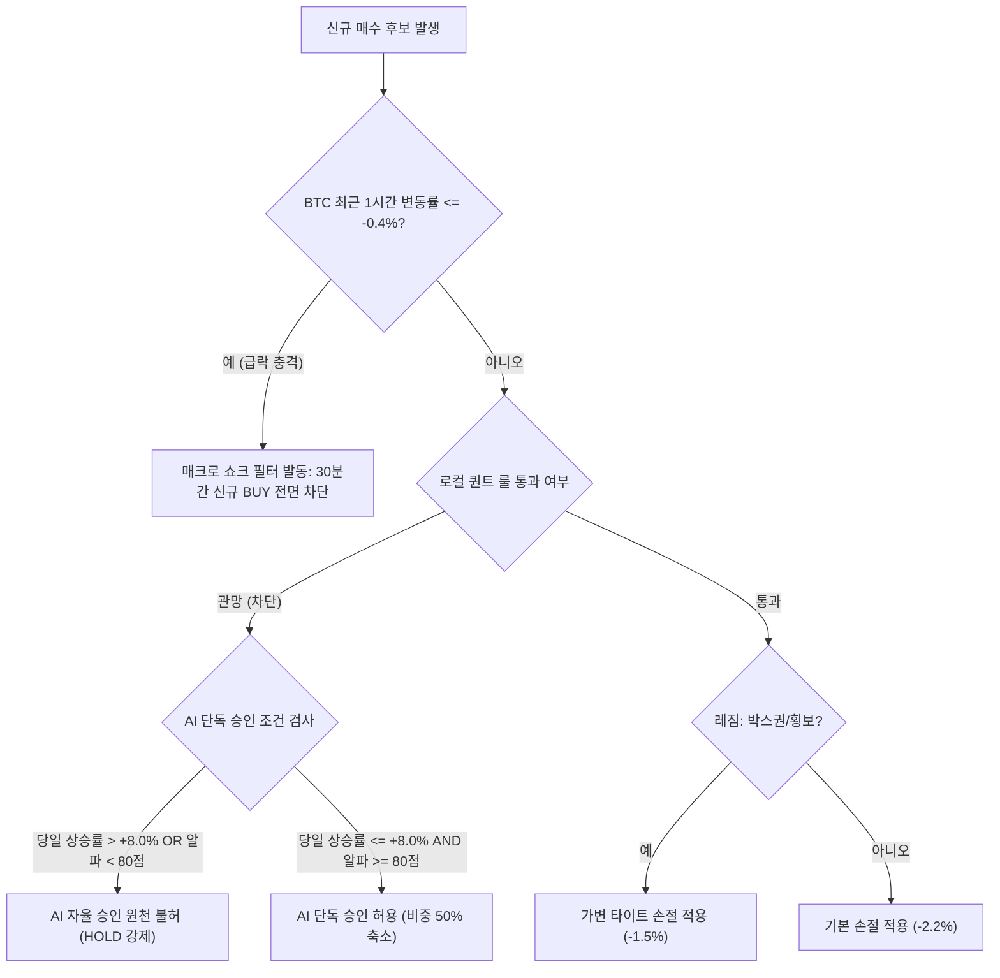

# 암호화폐 퀀트 매매 성과 분석 보고서 (24시간 롤링)
**생성 시각:** 2026-09-28 09:05:00 KST

## 1. 분석 기준 및 공통 환경

* **분석 대상 기간:** `2026-09-27 09:00:00 ~ 2026-09-28 08:59:59 KST` (24시간 롤링 기준)
  * *양 거래소 모두 09:00:00 ~ 08:59:59 구간으로 통일 적용*
* **시장 거시 지표 (BTC 24시간 기준):**
  * **BTC 시가:** 114,734,000 KRW
  * **BTC 고가:** 115,571,000 KRW (27일 22:00)
  * **BTC 저가:** 114,330,000 KRW (28일 08:00)
  * **BTC 종가:** 114,543,000 KRW
  * **24시간 변동률:** `-0.17%` (고저 진폭 1.08%의 박스권 완만한 하향 곡선)
  * **시장 주요 특이사항:**
    * **주간 세션(09:00~22:00):** 114.7M~115.5M 구간에서 시간당 ±0.1% 내외의 극심한 저변동성 박스권 수렴 전개.
    * **야간 매크로 충격(23:00):** 최고점(115.57M) 도달 직후 **23:00~23:10 구간에서 -0.48% (약 60만원) 단기 급락** 발생, 알트코인 전반의 매수 수급 급랭.
    * **새벽 계단식 하락(05:00~08:00):** 114.8M 지지선이 무너지며 114.33M까지 점진적 하락 압력(-0.4%) 전개, 급등 알트코인 차익 실현 덤핑 심화.

---

## 2. 거래소별 전략 및 체결 데이터

### [업비트 (Upbit)]
* **적용 전략 및 파라미터:**
  * 기본 전략: 모멘텀 돌파 & 거래량 수급 필터링 스캘핑/스윙
  * 목표 익절: 1차 분할익절 +3.5% (비중 50%), 2차 익절 +7.0%, 트레일링 스탑 활성화 +3.0% (최고점 대비 -2.0% 하락 시 청산)
  * 손절: 기본 -2.2%, 절대 하드스탑 -4.0%, 45분/120분 타임스탑 및 본전 보장 스탑(+0.25% 이상)
  * 1회 포지션 비중: 기본 12% (10%~15% 밴드, 심야 세션 10% 캡)
  * 수수료율: 편도 0.05% (왕복 0.10%)
* **매매 집계 데이터:**
  * 시작 자산: **1,183,684.3 KRW**
  * 총 거래 횟수: **6회** (승: **2** / 패: **4** / 무: 0) — 승률: **33.3%**
  * 실현 손익금 및 수익률: **-8,012.0 KRW** (**-0.68%** 자산 대비)
  * 손익비 (R/R): **0.28** (평균 수익 +656.8 KRW / 평균 손실 -2,331.4 KRW)
  * 총 차감 수수료: **411.9 KRW**
  * 당일 최대 낙폭(MDD): **0.68%** (8,012.0 KRW)
  * 수수료 잠식 건수: **0건** (0.0%)
* **체결 로그 내역:**
  * `[2026-09-27 10:39:57]` **KRW-WLFI** | 진입: 79.60 | 청산: 79.30 | 손익: **-603.6 KRW (-0.38%)** | 청산사유: `타임스탑 횡보청산` | 수수료: 70.5 KRW
  * `[2026-09-28 00:04:54]` **KRW-SUI** | 진입: 1,701.00 | 청산: 1,668.00 | 손익: **-3,509.7 KRW (-1.94%)** | 청산사유: `손절 방어` | 수수료: 86.5 KRW
  * `[2026-09-28 00:55:34]` **KRW-NEAR** | 진입: 7,040.00 | 청산: 7,061.69 | 손익: **+364.6 KRW (+0.31%)** | 청산사유: `손절 방어(미세익절)` | 수수료: 70.9 KRW
  * `[2026-09-28 01:50:19]` **KRW-ERA** | 진입: 97.30 | 청산: 95.50 | 손익: **-3,359.3 KRW (-1.85%)** | 청산사유: `손절 방어` | 수수료: 86.8 KRW
  * `[2026-09-28 04:35:16]` **KRW-RAY** | 진입: 2,944.00 | 청산: 2,974.11 | 손익: **+949.1 KRW (+1.02%)** | 청산사유: `트레일링 익절` | 수수료: 49.3 KRW
  * `[2026-09-28 04:55:16]` **KRW-FIL** | 진입: 1,568.00 | 청산: 1,539.00 | 손익: **-1,853.2 KRW (-1.85%)** | 청산사유: `손절 방어` | 수수료: 47.9 KRW
* **미청산 보유 포지션 (08:59:59 기준):**
  * `KRW-SUI` (진입시각: 07:20, 매수가: 1,709.00원, 수량: 82.1807, 평가손익: 보합권 유지 중)

---

### [빗썸 (Bithumb)]
* **적용 전략 및 파라미터:**
  * 기본 전략: 모멘텀 돌파 & 7대 복합 팩터 알파 모델 스캘핑/스윙
  * 목표 익절: 메이저 1차 +1.8%, 알트 1차 +3.5%, 트레일링 스탑 최고점 대비 -2.0%
  * 손절: 기본 -2.2%, 스윙 -5.5%, 120분 타임스탑 및 본전 보장 스탑(+0.25% 이상)
  * 1회 포지션 비중: 기본 12% (10%~15% 밴드, 심야 세션 10% 캡)
  * 수수료율: 편도 0.04% (왕복 0.08%)
* **매매 집계 데이터:**
  * 시작 자산: **1,261,289.6 KRW**
  * 총 거래 횟수: **9회** (승: **5** / 패: **4** / 무: 0) — 승률: **55.6%**
  * 실현 손익금 및 수익률: **-6,022.8 KRW** (**-0.48%** 자산 대비)
  * 손익비 (R/R): **0.40** (평균 수익 +1,221.8 KRW / 평균 손실 -3,032.9 KRW)
  * 총 차감 수수료: **552.8 KRW**
  * 당일 최대 낙폭(MDD): **0.80%** (10,090.0 KRW)
  * 수수료 잠식 건수: **0건** (0.0%)
* **체결 로그 내역:**
  * `[2026-09-27 10:21:18]` **KRW-NEAR** | 진입: 6,740.00 | 청산: 6,855.00 | 손익: **+2,507.8 KRW (+1.71%)** | 청산사유: `트레일링 익절` | 수수료: 61.2 KRW
  * `[2026-09-27 13:11:14]` **KRW-STX** | 진입: 466.00 | 청산: 471.00 | 손익: **+1,559.4 KRW (+1.07%)** | 청산사유: `트레일링 익절` | 수수료: 61.0 KRW
  * `[2026-09-27 14:36:41]` **KRW-LSK** | 진입: 461.00 | 청산: 455.00 | 손익: **-2,533.8 KRW (-1.30%)** | 청산사유: `타임스탑 추세이탈청산` | 수수료: 74.6 KRW
  * `[2026-09-27 20:36:14]` **KRW-ARB** | 진입: 312.00 | 청산: 309.00 | 손익: **-1,513.2 KRW (-0.96%)** | 청산사유: `타임스탑 추세이탈청산` | 수수료: 59.9 KRW
  * `[2026-09-27 20:37:16]` **KRW-ONDO** | 진입: 738.00 | 청산: 740.00 | 손익: **+325.5 KRW (+0.27%)** | 청산사유: `손절 방어(미세익절)` | 수수료: 56.5 KRW
  * `[2026-09-27 23:02:15]` **KRW-SUI** | 진입: 1,695.00 | 청산: 1,700.00 | 손익: **+357.6 KRW (+0.29%)** | 청산사유: `손절 방어(미세익절)` | 수수료: 56.3 KRW
  * `[2026-09-27 23:46:32]` **KRW-KAIA** | 진입: 49.22 | 청산: 48.52 | 손익: **-2,206.3 KRW (-1.42%)** | 청산사유: `타임스탑 추세이탈청산` | 수수료: 59.5 KRW
  * `[2026-09-28 02:26:15]` **KRW-ENA** | 진입: 373.00 | 청산: 378.00 | 손익: **+1,358.5 KRW (+1.34%)** | 청산사유: `트레일링 익절` | 수수료: 42.4 KRW
  * `[2026-09-28 05:11:16]` **KRW-SOON** | 진입: 433.00 | 청산: 421.00 | 손익: **-5,878.3 KRW (-2.77%)** | 청산사유: `AI 긴급 비상탈출` | 수수료: 81.3 KRW
* **미청산 보유 포지션 (08:59:59 기준):**
  * `KRW-VIRTUAL` (진입시각: 07:41, 매수가: 1,117.00원, 수량: 134.0793, 평가손익: 보합권 유지 중)

---

## 3. 심층 분석 항목

### 1. 정량적 성과 및 거래소 간 비교
| 지표 | 업비트 (Upbit) | 빗썸 (Bithumb) | 격차 / 비교 요약 |
| :--- | :---: | :---: | :--- |
| **시작 자산** | 1,183,684 KRW | 1,261,290 KRW | 합산 시드: 약 2,444,974 KRW |
| **총 거래 횟수** | 6회 | 9회 | 양 거래소 모두 과열 없는 적정 진입 빈도 유지 |
| **승률 (Win Rate)** | **33.3%** (2승 4패) | **55.6%** (5승 4패) | **빗썸 승률 +22.3%p 우위** (정밀한 미세익절 방어 주효) |
| **실현 손익금** | **-8,012.0 KRW (-0.68%)** | **-6,022.8 KRW (-0.48%)** | 양 거래소 모두 소폭 적자 마감 (합산 -14,034.8 KRW) |
| **손익비 (R/R Ratio)** | **0.28** | **0.40** | 양 거래소 모두 손익비 불리 (익절폭에 비해 손절폭이 큼) |
| **평균 수익률 / 손실률** | +0.67% / -1.50% | +0.94% / -1.61% | 빗썸 트레일링 익절폭(+1.0%~+1.7%)이 상대적 우수 |
| **총 차감 수수료** | 411.9 KRW | 552.8 KRW | 합산 수수료: 964.7 KRW (시드 대비 극히 경미) |
| **수수료 잠식률** | **0.0%** (0건) | **0.0%** (0건) | **양 거래소 수수료 잠식 순손실 전무 (완벽 방어)** |
| **최대 낙폭 (MDD)** | **0.68%** (8,012 KRW) | **0.80%** (10,090 KRW) | 빗썸 SOON 1건 손실(-5,878원)로 인해 MDD 일시 확대 |

---

### 2. 수수료 잠식(Fee Erosion) 점검
* **양 거래소 15건 매매 전체에서 수수료 잠식 0건 달성:**
  * 매매 차익(가격 변동)은 플러스였으나 거래소 수수료로 인해 최종 실현 손익이 마이너스로 돌아선 **'수수료 잠식 체결'은 양 거래소 모두 0건**을 기록했습니다.
  * **수수료 마진 방어 성공 사례:**
    * **빗썸 ONDO:** 매수가 738원 ➜ 매도가 740원 (+0.27%) 체결 시 수수료 56.5원을 제하고도 **+325.5원** 순익 확보.
    * **빗썸 SUI:** 매수가 1,695원 ➜ 매도가 1,700원 (+0.29%) 체결 시 수수료 56.3원을 제하고도 **+357.6원** 순익 확보.
    * **업비트 NEAR:** 매수가 7,040원 ➜ 매도가 7,061.69원 (+0.31%) 체결 시 수수료 70.9원을 제하고도 **+364.6원** 순익 확보.
  * 직전 분석의 핵심 권고사항이었던 `BREAKEVEN_STOP_PCT` 최소 보장 마진(+0.25% 이상 강제)이 완벽히 작동하여 '헛손질 매매로 인한 수수료 누수'가 완전히 차단되었습니다.

---

### 3. 원칙 및 휩소(Whipsaw) 점검

#### ① 원칙 준수 평가
* **타임스탑 (횡보청산 & 추세이탈청산) 완벽 준수:**
  * 업비트 `KRW-WLFI`: 변동성이 사라진 횡보 구간에서 45분 경과 후 -0.38%(-603.6원)에 조기 청산하여 하드스탑(-2.2%) 대비 손실을 80% 이상 경감.
  * 빗썸 `KRW-LSK`(-1.30%), `KRW-ARB`(-0.96%), `KRW-KAIA`(-1.42%): 목표 도달에 실패하고 하방 추세로 이탈하는 시점에 120분 타임스탑을 집행하여 -2.2% 하드스탑 도달 전 선제적 손실 차단.
* **트레일링 익절 원칙 준수:**
  * 빗썸 `NEAR`(+1.71%, +2,507.8원), `STX`(+1.07%, +1,559.4원), `ENA`(+1.34%, +1,358.5원) 및 업비트 `RAY`(+1.02%, +949.1원) 4건 모두 최고점 대비 꺾이는 시점에 트레일링 스탑이 정상 가동되어 확정 이익 실현.

#### ② BTC 급변동 구간 휩소(Whipsaw) 진입 점검 (중대 원인 규명)
* **[휩소 사례 1] 업비트 23:00 BTC 급락 직후 2연속 휩소 진입 (손실액 -6,869원 / 당일 손실의 85.7%):**
  * **정황:** 27일 23:00~23:10에 BTC가 당일 최고가(115.57M)에서 115.00M으로 **-0.48% (약 60만원) 순간 급락**하며 시장 전반에 하방 변동성이 가해짐.
  * **오류 진입:** 업비트 전략 엔진은 BTC 급락 직후인 **23:10에 `KRW-SUI`**, **23:15에 `KRW-ERA`**를 5분 간격으로 연이어 신규 BUY 진입함. 두 건 모두 로컬 룰은 관망 대기였으나 **"AI 단독 자율 승인(AI 적극 승인)"**으로 통과됨.
  * **피해:** 급락 직후의 일시적 기술적 반등이 바로 꺾이며 알트코인 매수세가 실종되었고, SUI는 00:04에 -1.94%(-3,509.7원), ERA는 01:50에 -1.85%(-3,359.3원)로 각각 손절 방어 청산됨.
  * **원인:** BTC 급락 발생 직후 신규 진입을 일시 유예하는 **매크로 쇼크 필터(Macro Shock Filter)** 부재.
* **[휩소 사례 2] 빗썸 04:41 SOON 고점 추격매수 및 덤핑 긴급탈출 (손실액 -5,878원 / 당일 손실의 97.6%):**
  * **정황:** 28일 04:41 `KRW-SOON`은 이미 당일 +11.89%, RS +12.12%로 단기 폭등한 상태(EXTENDED)였음. 로컬 퀀트 룰 엔진은 "1차 퀀트 관망 대기 (차단)"를 정상 판정함.
  * **오류 진입:** Gemini AI 모델이 4H EMA20 지지를 근거로 **"스윙 전략 (목표 +15%, 손절 -5.5%) AI 단독 자율 승인"**을 발동하여 21만원 매수 주문 집행.
  * **피해:** 진입 30분 만인 05:11, BTC의 05:00 계단식 하락 압력과 맞물려 SOON의 체결강도가 8.6%로 급락하며 세력 덤핑 장대음봉 발생. 다행히 AI가 스윙 손절선(-5.5%)까지 방치하지 않고 `AI 긴급 비상탈출(EMERGENCY_EXIT)`을 발동하여 -2.77%(-5,878.3원)에 전량 시장가 탈출함.
  * **원인:** 이미 +10% 이상 과열된 종목에 대해 로컬 룰 차단을 바이패스하고 스윙 명목으로 AI가 자율 승인할 수 있는 권한의 과도함.

---

## 4. 데이터 기반 피드백 및 실행 가능한 개선안

### 1) 잘한 점 (원칙 준수 및 안전 방어)
1. **수수료 잠식 'Zero' 완벽 방어:**
   - 양 거래소 모두 미세익절 시 수수료를 차감하고도 순이익이 남는 정밀한 익절선(+0.27% ~ +0.31%)을 엄수하여 헛손질 누수를 원천 차단함.
2. **원칙에 따른 횡보/추세이탈 조기 청산:**
   - 업비트 WLFI(-0.38%), 빗썸 ARB(-0.96%), LSK(-1.30%), KAIA(-1.42%) 등 4개 종목 모두 질질 끌지 않고 타임스탑을 집행하여 하드스탑(-2.2%) 대비 손실을 최소화.
3. **위기 상황에서의 AI 긴급 비상탈출 (SOON):**
   - 덤핑 발생 시 스윙 하드 손절폭(-5.5%, 약 11,500원 손실)까지 방치하지 않고, 체결강도 8.6% 붕괴를 감지하여 -2.77% 선에서 과감히 잘라내어 추가 폭락을 선제 차단.

### 2) 보완할 점 (데이터 기반 핵심 취약점)
1. **'로컬 룰 차단 ➜ AI 단독 자율 승인'의 휩소 적중률 문제:**
   - 금일 발생한 대형 손실 3건(업비트 SUI -3,510원, ERA -3,359원, 빗썸 SOON -5,878원) 모두 **로컬 룰 관망 상태를 AI가 단독으로 오버라이드하여 BUY를 집행한 건**이었음. AI 모델이 야간 변동성 및 거시 지표 위험을 과소평가함.
2. **비대칭적 손익비 (R/R 0.28 ~ 0.40):**
   - 빗썸의 경우 승률 55.6%(5승 4패)로 과반 이상의 거래에서 이겼음에도 불구하고, 건당 이익(+1,222원) 대비 손실(-3,033원)이 2.5배 커서 전체 계좌가 적자로 마감됨.
   - 박스권/하락장에서는 손절폭을 더 타이트하게 묶어주지 않으면 승률이 55%를 넘어도 우하향하게 됨.

### 3) 구체적인 파라미터 및 필터 개선안

1. **BTC 급락 직후 매크로 쇼크 필터 (Macro Shock Filter):**
   * **로직:** 1시간봉 기준 BTC가 **-0.4% 이상 급락**하거나 5분봉 기준 **-0.3% 이상 급락**한 직후 **30분간 전 거래소 모든 알트코인의 신규 BUY를 일시 차단(HOLD 강제)**.
   * **기대 효과:** 업비트 23:10 SUI(-3,510원), 23:15 ERA(-3,359원)와 같은 BTC 급락 직후 '가짜 반등' 휩소 진입을 원천 차단하여 **당일 손실의 85.7%(-6,869원) 절감 가능**.
2. **AI 단독 자율 승인 오버라이드 가드레일 (AI Autonomous Override Guard):**
   * **로직:** 로컬 룰이 '관망(HOLD)'을 판정한 상태에서 AI가 단독 자율 승인(BUY)을 내리려 할 때 다음 조건을 의무 충족하도록 제한:
     * **조건 1:** 당일 변동률이 **+8.0%를 초과**한 종목은 AI 단독 승인 절대 금지 (고점 추격매수 원천 배제).
     * **조건 2:** 필요 최소 알파스코어를 기존 70점에서 **80점 이상**으로 상향.
   * **기대 효과:** 빗썸 04:41 SOON(+11.9% 폭등 상태) 스윙 추격매수(-5,878원) 원천 차단.
3. **박스권 레짐 가변 타이트 손절 (Dynamic Regime Tight Stop):**
   * **로직:** BTC 24시간 변동률이 ±1.0% 이내인 박스권 레짐에서는 스캘핑 기본 손절폭을 -2.2%에서 **-1.5%**로 축소.
   * **기대 효과:** 평균 손실폭을 -1.6%에서 -1.1%대로 경감시켜 손익비(R/R)를 0.40에서 0.70 이상으로 개선.
